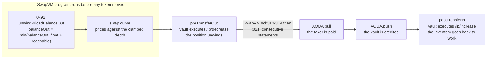

<div align="center">

# Bebecita

**An order book funded by a Uniswap position.** The maker's inventory never sits idle in a wallet: it stays in a Uniswap v4 liquidity position and is unwound just in time, one instruction before the tokens leave, inside the same transaction as the fill.

</div>

> Your Uniswap liquidity can quote an order book without leaving the pool.

## Live on Ethereum Sepolia

| Contract | Address |
|---|---|
| BebecitaRouter, our modified SwapVM | [`0x354422f6e4e3476b540E306A6DdFb4638d9EA5c3`](https://sepolia.etherscan.io/address/0x354422f6e4e3476b540E306A6DdFb4638d9EA5c3) |
| BebecitaVault, the maker | [`0xE703F509ba1bF70BcFa4957a7090e73B627dE76a`](https://sepolia.etherscan.io/address/0xE703F509ba1bF70BcFa4957a7090e73B627dE76a) |
| bALPHA | [`0xdB41CB0A2EEFF8Ed53Ef019D4C9826744f500B7F`](https://sepolia.etherscan.io/address/0xdB41CB0A2EEFF8Ed53Ef019D4C9826744f500B7F) |
| bBRAVO | [`0x0128Ac6B5E3364b022e55A0cf9c0cb4987B3B20f`](https://sepolia.etherscan.io/address/0x0128Ac6B5E3364b022e55A0cf9c0cb4987B3B20f) |

The maker's inventory, opened through the Uniswap API and owned by the vault:

| | |
|---|---|
| Position | v4 NFT [`#37804`](https://sepolia.etherscan.io/token/0x429ba70129df741B2Ca2a85BC3A2a3328e5c09b4?a=37804), full range, 100,000 of each token |
| Pool | `0x25f7dd131e5548b22a4bf9b95587514d69960261c1defff0ec465f9f90d54489`, fee 3000, spacing 60, no hook |
| Reachable per fill | 23,503 tokens, which is 25% of the position after a 5% haircut |
| Aqua strategy | `0x9f853f6da4f2ad117c0a19545466e28be0343bf17f4d07067ffbcfa55d6e9da3` |
| Program | `[0x92 unwind][0x51 concentrate][0x02 salt]`, 142 bytes, the curve bounded by the position's own range |

The vault was redeployed once the position existed, because `TOKEN_ID` is immutable and the first deployment
predated the pool. That is the whole reason the address above differs from the one in the deploy transaction.

The router's `AQUA()` getter returns `0x499943E74FB0cE105688beeE8Ef2ABec5D936d31`, the canonical Aqua address, which is the one line that
proves the official contracts are the ones doing the work. Its `OPCODE_UNWIND_PRICED_BALANCE_OUT()` returns
`146`, that is `0x92`.

## One fill, end to end



The arrow between the unwind and the payment is the whole design. `preTransferOut` is the only point in
SwapVM guaranteed to run immediately before tokens leave the maker, and it holds in both transfer orders the
router supports. That is what makes just in time collateral possible at all.

## The removal test, both ways

This is the shortest description of what the project is, and it is the first thing to check.

**Take the Uniswap API out** and there is no calldata to place in either hook slice, the vault has no free float, and `AQUA.pull` reverts on the first fill on a `safeTransferFrom` out of an empty wallet. There is no degraded mode.

**Take the custom SwapVM instruction out** and Aqua quotes against the virtual balance the maker shipped, which is enormous by construction, the curve prices depth that does not exist, and the fill asks for more than the unwind can produce. That failure is asserted in the test suite, not described: see `test_WithoutInstruction_QuotePassesAndSwapReverts`.

Both legs break. Neither is decoration.

## Why this is possible at all

Aqua never custodies anything. Opening a strategy is not a deposit, it is writing a number into a mapping, and that number is backed by nothing: `Aqua.ship` performs no solvency check, and `Aqua.pull` decrements the virtual balance and only then calls `safeTransferFrom` on the maker's wallet. So Aqua does not require you to keep funds available, it requires that one transfer to succeed on the last line.

That is the whole opening. The money only has to be there for the width of two instructions, so it can work somewhere else until then.

There is no simultaneity here and the pitch should never claim any. The position is the collateral, and settlement converts it just in time, made safe by atomicity.

## How a fill runs

| Step | Where | What happens |
|---|---|---|
| 1 | `runLoop` | Instruction `0x92` reads the vault's free float and the position's liquidity, and clamps `balanceOut` to what is genuinely reachable. Instruction `0x51` then prices against the truth, on the position's own range, and clamps its own output at the same number if the taker asked for more. |
| 2 | `SwapVM.sol:310-314` | `preTransferOut` fires. The vault executes the `/lp/decrease` calldata against the v4 PositionManager. The position unwinds, the vault receives the output token. |
| 3 | `SwapVM.sol:321` → `Aqua.sol:63-70` | `AQUA.pull` runs on the very next statement and pays the taker. |
| 4 | `SwapVM.sol:262` | `AQUA.push` credits the vault with the taker's input. |
| 5 | `SwapVM.sol:282-286` | `postTransferIn` fires. The vault executes the `/lp/increase` calldata. The inventory goes back to work. |

Steps 2 and 3 are consecutive statements in the sponsor's own source, and that ordering holds in both transfer orders the router supports. `preTransferOut` is the only point in SwapVM guaranteed to run immediately before tokens leave the maker, which is the entire reason this design exists.

## The instruction

`_unwindPricedBalanceOut1D`, opcode `0x92`, in the `0x90-0xaf` balances tuning bank of `OpcodeList.sol`, whose rule reads: *"New instruction MUST take the next free `_Ix` slot of its family bank."* The claim is machine checked rather than asserted: `test_InstructionTakesReservedSlotOfBalancesTuningBank` asserts `uint256(Opcode._92)` equals the dispatched index.

It is **fully `view`**. It writes no storage, so quote/swap consistency, the only invariant of the SwapVM core suite that cannot be skipped, is satisfied structurally rather than by discipline. It only ever lowers `balanceOut`, never raises it, and never touches `balanceIn`, because on a constant product curve lowering `balanceIn` would raise the payout, which is the opposite of the intent.

```
balanceOut = min(balanceOut, float + reachable)
reachable  = positionLiquidity x unitsPerLiquidity x maxUnwindPct x (1 - haircut)
```

## The curve

The program prices on `XYCConcentrateSwap`, opcode `0x51`, and not on `XYCSwap`, `0x50`. Two reasons, and both
are load bearing.

**`0x50` never clamps its own output.** Once `0x92` has lowered `balanceOut` to what the position can genuinely
release, a taker asking exact-out for more than that gets an arithmetic panic out of the VM:
`amountIn = ceilDiv(amountOut * balanceIn, balanceOut - amountOut)` underflows above the balance and divides by
zero at it. `XYCConcentrate` clamps on `balanceOut` and re-solves the other side for the clamped amount, in both
directions. The same moment becomes an exact partial: the taker is paid exactly the reachable collateral and
charged exactly what that costs. `TakerTraitsLib.validate` was written for this, it requires
`takerAmount >= amountOut`, never equality, so a partial is a legal fill and not a tolerated accident. Both
halves are asserted in `test_ExactOut_AboveReachableCollateral_IsAnExactPartialInsteadOfARevert`.

**Its two arguments are the position.** `0x51` takes `sqrtPriceMin` and `sqrtPriceMax`, and `yarn aqua` fills
them from the position's tick bounds and the live `sqrtRatioX96` returned by `POST /lp/pool_info`, then compiles
them into the program bytes. The book's curve is the range of the Uniswap position backing it. Re-range the
position and the book concentrates with it, which is
`test_ExactIn_ClampedFill_ReSolvesTheInputAndSettles`: on a range of 0.25 to 4, a taker offering 3,000 is
charged 1,693.61 and paid the whole 475 of reachable collateral, where `0x50` charges the full 3,000 and pays
109.62.

One honest detail. This position is full range, ticks `-887220` to `887220`, and full range does not survive the
instruction's 1e18 fixed point: `sqrt(1.0001^-887220)` is `5.4e-20`, which truncates to zero, and
`XYCConcentrateArgsBuilder.build2D` rejects a zero lower bound with `ConcentrateInvalidPriceBounds`. The shipped
bounds are therefore the range clamped to the widest window the format carries, a factor of `1e9` on the sqrt
price either side of spot, which is `1e9` and `1e27` in the strategy record and ticks `-414486` to `414486`. At
that width the virtual reserves add about a billionth of the real ones, so the curve is constant product to nine
significant digits and it is the clamp that changed, not the price: `915.372435469721101398` out against
`915.372435390345788254` on `0x50`, a difference of 79 gwei of token on 915 tokens.

## The vault, and taker supplied calldata

The withdrawal calldata comes from the taker, per fill, because the Uniswap API builds it against live chain state and it cannot be baked into an immutable order. The vault does not trust it. It pins the callee, pins the selector, and judges the payload by its effects:

1. after the unwind, the output balance must have grown by at least the amount the VM computed, which the hook receives as a parameter, so this is a floor and not a sign check;
2. the other side of the book may not shrink;
3. the position may not lose more liquidity than the maker authorised for one fill;
4. a redeposit may only grow the position.

A taker can therefore choose *how* to unwind, but never whether the maker ends up short, and never what the vault ends up owning.

## URC-3

The vault implements [`IHookStats`](https://gov.uniswap.org/t/urc-3-hook-tvl-and-effective-liquidity-reporting/26155), the Uniswap Labs standard for reporting TVL and immediately swappable liquidity, created 2026-06-11. Its normative invariant is that `getEffectiveLiquidity` should not exceed `getReserves`, which is exactly what instruction `0x92` enforces inside the VM. URC-3's own motivating cases list, verbatim, *"deploy liquidity in external protocols"*, *"rehypothecate assets"* and *"maintain reserves outside the PoolManager"*.

## Chain

Everything runs on **Ethereum Sepolia**, and that is not a fallback.

It is the only chain outside mainnet carrying both halves of this project. The official Aqua is deployed there at its canonical address `0x499943E74FB0cE105688beeE8Ef2ABec5D936d31`, with bytecode byte for byte identical to the Base deployment, `sha256 e30d2eab49ae15c876b4d75131185c78bb28e88ac8a21faab06336139b84a1af` on both. No 1inch README lists a testnet, so this was established by probing the chain. Base Sepolia and Unichain Sepolia carry no Aqua at either known address.

The Uniswap API accepts chainId `11155111`, and Uniswap's own FAQ states there is no sandbox and that testing is done against the supported testnets through the production endpoints.

| Contract | Address |
|---|---|
| Aqua, official | `0x499943E74FB0cE105688beeE8Ef2ABec5D936d31` |
| AquaSwapVMRouter, official | `0x8fdd04dbf6111437b44bbca99c28882434e0958f` |
| v4 PoolManager | `0xE03A1074c86CFeDd5C142C4F04F1a1536e203543` |
| v4 PositionManager | `0x429ba70129df741B2Ca2a85BC3A2a3328e5c09b4` |
| v4 StateView | `0xe1dd9c3fa50edb962e442f60dfbc432e24537e4c` |

## What a fill costs

| | gas |
|---|---|
| Bebecita fill, including both PositionManager calls | 323,264 to 357,464 |
| A bare Aqua fill on the same curve, for reference | about 100,000 |

Measured on Sepolia, from the receipts of six real fills. The spread comes from whether the redeposit finds an
existing position tick range warm.

The overhead is the honest cost of the design: every fill carries a decrease and an increase against the v4
PositionManager, on top of the swap itself. It is worth naming rather than hiding, because it is also what
sets the floor under a useful fill. Below a certain size a clip costs more in unwind gas than it earns in
spread, and that boundary is a real property of the product rather than a defect.

For comparison, the reference figures published in the swap-vm gas snapshot put `XYCConcentrate` alone at
101,161 gas on a swap and 16,898 on a quote.

## Uniswap API integration

The API is the funding mechanism, not a data source. Qualifying function claimed: **liquidity provision**, literally, with two PositionManager calls built by the API at fill time and executed on-chain inside every fill.

| Endpoint | Called from | Role |
|---|---|---|
| `POST /lp/pool_info` | `solver/src/aqua.ts` | **Once per strategy.** Its `sqrtRatioX96` and the position's ticks become the two arguments of instruction `0x51`, compiled into the program bytes. The response is a parameter, not a display value |
| `POST /lp/check_approval` | `solver/src/setup.ts` | With `generatePermitAsTransaction: true`, returns permits as executable transactions instead of EIP-712 typed data. This is what makes a contract owned position possible: the vault cannot sign, only execute |
| `POST /lp/create` | `solver/src/setup.ts` | Opens the pool and the position through `newPool`, so the demo owns its own pool and depends on no pre-existing testnet liquidity |
| `POST /lp/decrease` | the browser, or `solver/src/uniswap.ts` | **Once per fill.** Its calldata goes verbatim into the `preTransferOutHookData` slice of `TakerTraits` and is executed by `BebecitaVault.preTransferOut` |
| `POST /lp/increase` | the browser, or `solver/src/uniswap.ts` | Same fill. Its calldata goes into `postTransferInHookData` and is executed by `BebecitaVault.postTransferIn` |
| `POST /lp/claim_fees` | the browser, or `solver/src/uniswap.ts` | Closing panel: the fees the same capital earned while it was quoting |

**Note for the reviewer.** The `/lp/*` operations belong to the same OpenAPI document as `trade-api.gateway.uniswap.org/v1` and use the same `x-api-key` scheme, but the document carries a per-path server override and they are served from `https://liquidity.api.uniswap.org` with no version prefix. Grepping our request logs for `trade-api` will find nothing, which is why this is stated here rather than left to be discovered.

See [FEEDBACK.md](FEEDBACK.md) for what we found while integrating.

## Quickstart

```bash
yarn install
cp .env.example .env          # fill UNISWAP_API_KEY and DEPLOYER_PRIVATE_KEY
yarn gate0                    # six checks that decide whether the project exists
yarn test                     # 19 tests, no network needed
forge script contracts/script/Deploy.s.sol --rpc-url sepolia --broadcast --verify
yarn setup                    # pool, position, vault custody, all through the LP API
yarn aqua                     # opens the strategy the book quotes
yarn fill                     # one fill on Sepolia, end to end
yarn inventory                # what those fills did to the maker's inventory
yarn rebalance                # trade the inventory home, between fills
```

`yarn setup` is resumable and reads `deployments/sepolia.json` as its state: a position already recorded
there is reused rather than duplicated, and `--recreate` opens a second one. `yarn aqua` picks a fresh salt
on every run, because a strategy hash can be shipped exactly once and the second run would otherwise revert
with `StrategiesMustBeImmutable`.

## The fill

```bash
yarn fill                     # quote, size, unwind, swap, redeposit, one transaction
yarn fill --amount=250        # a smaller clip
yarn fill --dry               # simulate against live state and broadcast nothing
yarn demo:reset               # re-salt the order and re-ship it, ready for a fresh fill
```

`yarn fill` reads the quote through `quote()` on a staticcall, which is what `asView()` exists for, sizes the
withdrawal from the `amountOut` that came back, rounds the percentage up because
`liquidityPercentageToDecrease` is an integer, fetches `/lp/decrease` and `/lp/increase`, encodes the taker
traits and sends `swap()` from the taker's own key. Then it reads the receipt back and checks the two
`ModifyLiquidity` events, so the claim is verified from the chain and not from the console.

The decisions all live in `solver/src/fillPlan.ts`, which reaches the chain and the API through two injected
interfaces and therefore does not know where it is running. The command line supplies a private key and an
`x-api-key` header, the browser supplies the connected wallet and the dev server proxy, and there is no second
copy of the sizing arithmetic between them.

`yarn demo:reset` exists because a strategy hash can be shipped exactly once, ever. It walks the salt space
for a program Aqua has never seen, ships that one from the vault with the same balances and the same risk
parameters, and leaves the taker approved. Nothing else moves: same pool, same position, same vault, same
router, one byte of difference in a no-op instruction.

| Latest fill on Sepolia | [`0x2d06c096…`](https://sepolia.etherscan.io/tx/0x2d06c09613389cdd2260213d302a3ae3a2875c71e986b310595a3592adaafb55) |
|---|---|
| Program | `0x92` unwind, `0x51` concentrate bounded by the position, `0x02` salt |
| Swapped | 1,000 bBRAVO in, 879.312663104099977232 bALPHA out |
| Unwind | 1% of the position, released 921.42 bALPHA against 879.31 owed, surplus kept as float |
| Redeposit | liquidity back from 101,448.88 to 101,495.78 in the same transaction |
| Gas | 343,942 |
| Taker | `0xF29bCE83AF15acC7AdaaeaC34A5BE9165C52b4d0`, a wallet that funded itself through the public `mint` |

That taker is not the deployer and holds nothing but what it minted itself, which is the point of the two
buttons on the dashboard: the fill is signed by whoever is connected, and the maker's guards do not care who
that is.

The first fill this project ever ran is
[`0xe0a395b7…`](https://sepolia.etherscan.io/tx/0xe0a395b72e3ac659b226712a963b23c1173d2ccf3f9e95d84b028494a67bcc84),
1,000 bBRAVO for 23.72 bALPHA. The price is not a market move, it is the shipped book: that fill quoted before
the input side was shipped from `reachableFromPosition` instead of generously, which is what brought the book
back to something a human can read.

## Inventory, and trading it home

```bash
yarn inventory                # what every fill did to the maker's inventory, read off its own receipt
yarn rebalance                # sell the surplus, put both sides back into the position
yarn rebalance --dry          # size it against live state, call the API for real, broadcast nothing
```

A fill is not balance neutral for the maker and it never was. `/lp/decrease` returns both tokens pro rata, the
fill pays the taker in one of them and is paid in the other, and the redeposit is two sided and therefore
capped by whichever token the maker keeps selling. Fifteen fills put **39.85%** of the removed liquidity back,
left **23,947 bBRAVO** of free float in the vault, and took the position from 100,000 of liquidity to 92,140.
That is what one directional flow does to any market maker rather than something this design does to itself,
and the answer has always been the same one: trade the inventory home, and charge a spread that covers doing
so.

| One rebalance on Sepolia | [`0x6c8f9009…`](https://sepolia.etherscan.io/tx/0x6c8f9009f891da976373d016dbce77fc1547416a812dd6499d1093f6f4707f8d) |
|---|---|
| Float | 21,859.61 bBRAVO and 2.07 bALPHA, down to 35.73 and 0.93 |
| Position | 92,140.39 of liquidity back to 102,473.62, which is 102.47% of what it opened with |
| Sold | 10,363.05 bBRAVO for 9,290.22 bALPHA, `POST /quote` then `POST /swap` on the trade host, `x-permit2-disabled: true` so an approve and an execute replace any signature |
| Where | at the owner, on the `sweep` the vault already had, between fills and never in the settlement path |

The size is a single sided zap rather than a dump: selling the whole surplus would leave the vault holding one
token against a pool priced where that sale left it, which is the same trap one level down. See
[docs/ARCHITECTURE.md](docs/ARCHITECTURE.md), section Inventory, for what the rebalance costs and for the one
maker parameter it moves, and [docs/DECISIONS.md](docs/DECISIONS.md) for why this is not inside the fill.

## Frontend

```bash
cd app && yarn install && yarn dev     # http://localhost:5173, and nothing else
```

A landing page and a dashboard, Vite plus React plus TypeScript plus viem, no wallet kit. The dashboard reads
the position, the vault and the Aqua balances live from Sepolia, calls `quote()` through a staticcall, calls
the Uniswap LP API for real, and shows every API request and response with its response headers. Addresses are
read at runtime from `deployments/sepolia.json` and `solver/src/config.ts`, never copied. See
[app/README.md](app/README.md).

**Run a fill** does the whole thing in the tab, signed by the connected wallet. It quotes, sizes the unwind,
calls `/lp/decrease` and `/lp/increase`, encodes the taker traits and sends `swap()`. The transaction is then
read back from its own receipt: the `Swapped` amounts, and the two PositionManager calls with the position's
liquidity before and after each.

The connected wallet is the taker, so it needs the input token and an allowance to the router. Both are one
button away, **Mint** and **Approve the router**, because `TestERC20.mint` is public. A judge can drive the
demo from their own wallet without asking anyone for anything.

There is one port and no backend. The dev server proxies two things and runs none of this project's logic: it
attaches the Uniswap key to `/api/uniswap` so the key never reaches the bundle, and it forwards JSON-RPC on
`/api/rpc` so a private endpoint can stay out of it. The Uniswap gateway answers browser preflights on the
`/lp/*` paths, so a build that carries its own key can call it with no proxy at all.

### Why there is no solver process, and why one would not be a weakness either

A solver is off-chain by nature in every RFQ system, including 1inch's own Fusion: the maker signs an intent,
resolvers compete off chain, and the chain only ever sees the settlement. So the question is never whether a
solver runs off chain, it is whether the maker has to trust it. Here it does not. The taker is whoever presses
the button, the order and the vault are immutable, and everything the taker supplies per fill is judged on
chain by `BebecitaVault`'s four guards: the output balance must grow by at least the amount the VM computed,
the input side may not shrink, one fill may not unwind more than `maxUnwindPct` of the position, and a
redeposit may only grow it. An adversarial taker therefore chooses how the position is unwound and never
whether the maker ends up short. That is why deleting the backend cost this project nothing: there was no
trust in it to remove. What kept the fill in a process was one detail, `TakerTraitsLib.build` being `internal
pure` Solidity, and porting it removed the process.

The port is not asserted, it is proved: `contracts/test/TakerTraits.t.sol` builds twelve argument shapes with
the sponsor's own library and asserts byte equality against what `solver/src/takerTraits.ts` wrote for the
same arguments, then round trips the live fill shape back through the library's own slice readers.
`contracts/script/Fill.s.sol` stays in the repository as the Solidity reference that diff is taken against,
and it makes the same assertion a second time on payloads nobody chose: every `yarn fill` writes its request
to `deployments/fill.local.json`, and replaying it through the script checks the TypeScript blob against
`TakerTraitsLib.build` on the 676 and 708 bytes of v4 Actions the Uniswap API built for that fill.

```
forge script contracts/script/Fill.s.sol --rpc-url sepolia --skip test
  taker traits      TypeScript port matches TakerTraitsLib.build byte for byte
```

The dashboard leads with **SLAC**, the Shared Liquidity Amplification Coefficient of the Aqua whitepaper,
page 4: the total liquidity provisioned across every strategy this vault has shipped, over the wallet equity
backing it. It is shown twice, because the denominator is the whole argument. Against the vault's plain ERC20
balances it is in the hundreds, and undefined when the float is zero, which is what a wallet balance check
sees. Against free float plus `reachableFromPosition()`, the figure instruction `0x92` clamps to on chain, it
is finite. Every strategy hash comes from the vault's own `Shipped` events, not from the deployment record,
which only ever names the live one.

Iteration discipline, measured on the build machine: a full `forge build` costs **3 min 49** because of `via_ir`, `forge build --skip test` costs **17 s**, and `forge test --match-path <one file>` costs **13 s**. Never run the bare commands.

## Layout

```
contracts/src/instructions/   UnwindPricedBalances, the 0x92 instruction and its args builder
contracts/src/opcodes/        BebecitaOpcodes, the Aqua table plus 0x92 and three rewired Controls
contracts/src/routers/        BebecitaRouter, the redeployed SwapVM pointing at the official Aqua
contracts/src/vault/          BebecitaVault, the maker: position custody, hooks, URC-3 reporting
contracts/src/interfaces/     IHookStats (URC-3)
contracts/test/               19 tests: the negative moment, the partial fills, the four guards, the traits port
contracts/script/             Sepolia deployment, and the Solidity reference for the taker traits
solver/src/                   the fill plan and the taker traits, shared with the browser, plus the LP API
                              client, gate zero, setup and the Aqua strategy
app/                          landing page and dashboard, Vite plus React plus viem, and the taker
docs/                         architecture, onboarding, demo script, decisions
```

## Rewired instructions

`AquaOpcodes` dispatches 19 opcodes where the full `Opcodes` table dispatches 46. Three of them, `Stop`, `Revert` and `JumpIfDirection`, were added to `Controls.sol` on 2026-07-05 and are unreachable from any Aqua program: a program using them reverts with `UnknownOpcode`. They are wired back in `BebecitaOpcodes` because a program that cannot halt early cannot express a conditional strategy. That is three `else if` and a test, and the diff is in one file.

## License

MIT
